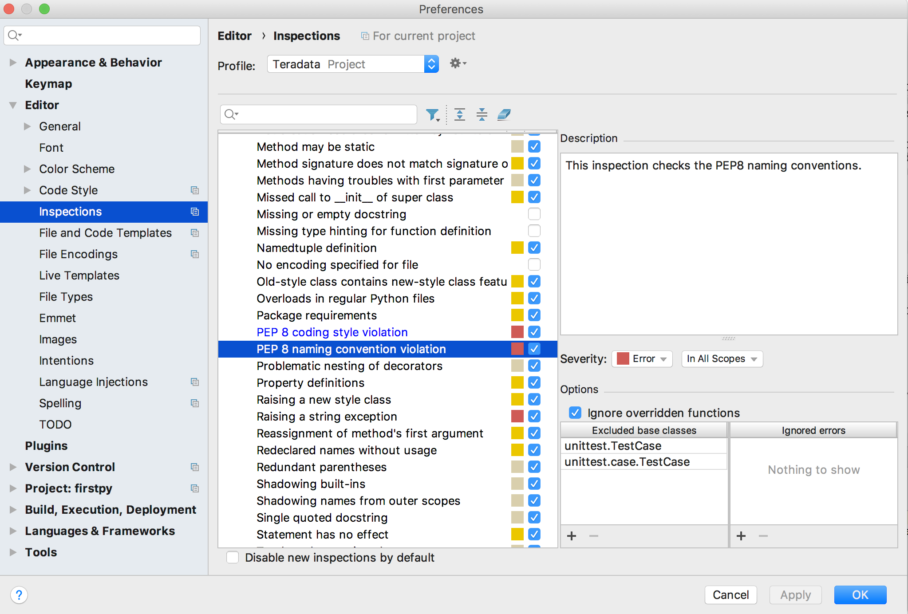

# R Coding Style

**Author: Febiyan Rachman <febiyan.rachman@teradata.com>**  
 
Having a style that is followed by R-using Data Scientists or Engineers will benefit Think Big Analytics or Teradata in the long run. The style needs to be enforced to make the code more easily understandable and consistent.

It is good to keep in mind that someday there will be someone reading your code to solve similar problems, and it is important for them to understand it as soon as they read it.

There are multiple R style standards available in the internet like Google's and Tidyverse. This section heavily borrows from Tidyverse, and is compacted to address the most common questions.

Let's start with naming conventions.

## Naming Convention
Names that you give to R files, variables, constants, and functions should be **meaningful**, short enough to be concise and yet long enough to be easily understood. Easily understood name is the key to quality code, and, unless performance/efficiency is critical, it should be the first priority.

### Files

> TODO / TODISCUSS: Should file names start with nouns or verbs?

Don't use camel case in file names. Use underscores to separate words. Avoid capitalization of function names or packages since R is case sensitive. Use a colon before enumerations or bulleted lists.


```
calculate_logins.R
```

When there are files that needs to be executed sequentially, use numbers as a prefix.

```
00_calculate_logins.R
01_calculate_logouts.R
```

### Identifiers
#### Variables

Generally speaking, variable names should be in a form of a noun. The preferred syntax for variable names is all lower case letters and words separated with underscores (e.g `variable_name`). There are style guides that prefer names with camelCase, and that is acceptable too.


```
# Preferred
variable_name
# Okay
variableName
```

For boolean variables, make sure you prefix them with `is` followed by an adjective.

```

isGood <- true
```

#### Functions
Function names should start with a verb. Function names need to be in non-capitalized letters and are separated using underscores.

1-2-words long function name is ideal. 3-words long function name is still okay. Rethink about your function names if it exceeds 3 words or is too long in character length.


```
# Preferrable
add_numbers <- function(a, b) {
  a + b
}
```

## Syntax

### Quotes
Quotes are used to surround a text string. Use `"`, not `'`, for quoting text. The only exception is when the text already contains double quotes and no single quotes.

```
"Text"
'Text with "quotes"'
'Text with "double" and \'single\' quotes'
```

### Spacing
Put a space before and after `=` when naming arguments in function calls. Most infix operators (`==`, `+`, `-`, `<-`, etc.) are also surrounded by spaces, except those with relatively high precedence: `^`, `:`, `::`, and `:::`.

Always put a space after a comma, and never before (just like in regular English). Prefer parentheses over irregular spacing to highlight operator precedence.

```
# Good
average <- mean((feet / 12) + inches, na.rm = TRUE)
sqrt(x^2 + y^2)
x <- 1:10
base::get

# Bad
average<-mean(feet/12 + inches,na.rm=TRUE)
sqrt(x ^ 2 + y ^ 2)
x <- 1 : 10
base :: get
```

Place a space before `(`, except when it???s part of a function call.

```
# Good
if (debug) show(x)
plot(x, y)

# Bad
if(debug)show(x)
plot (x, y)
```

### Indentation
Your code statements, most of the time, will consist of more than one level of hierarchy. Indentation will make your code more readable if used correctly.

Curly braces, `{}`, define the the most important hierarchy of R code. To make this hierarchy easy to see, **always indent the code inside {} by two spaces**.

A symmetrical arrangement helps finding related braces: The opening brace is the last, the closing brace is the first non-whitespace character in a line. Code that is related to a brace (e.g., an if clause, a function declaration, a trailing comma, ???) must be on the same line.

```
# Good
if (y == 0) {
  if (x > 0) {
    log(x)
  } else {
    message("x is negative or zero")
  }
} else {
  y ^ x
}

# Bad
if (y == 0)
{
    if (x > 0) {
      log(x)
    } else {
  message("x is negative or zero")
    }
} else { y ^ x }
```

It???s OK to drop the curly braces if you have a very simple and short if statement that fits on one line. If you have any doubt, it???s better to use the full form.

```
y <- 10
x <- if (y < 20) "Too low" else "Too high"
```

## Documentation
Documentation increases the understandability of your code, and usually comes in the form of comments alongside the code. The following guide makes sure your comment s

### File / Function Comments
Always indent with one space after `#'`. Use `roxygen2` to automatically create Rd files for you. 

```
#' Title contains the general idea of the file / function
#' 
#' @description
#' This is some description, you can omit the tag above is the description is 
#' quite short, but generally you will need to keep it around.
#'
#' @param key This is a parameter definition for a function. If it has multiple
#'   as column headings. 
#'
#' @examples
#' sin(pi)
```

### Code Comments
When commenting a line or a block of code, make sure the comment also answers the WHY. The WHAT can be explained by your code.

```
# Age of students we're interested in is between 15 and 18
if (age => 15 & age <= 18) {
  # Inner comments need to follow the indentation, and this is the
  # second line of the comment
}

```

### Inline Comments 
Inline comments can be used for variable declarations and library loading statements. Typically, inline comments should be used for short-length statements only. Inline comments should be as concise as possible, too.

```
y <- 10 	# This is an okay inline comment
x <- 5		# Short comments only
```

## Linting
Linting is the process of running a program that will analyse code for potential errors. It is sometimes called "static code analysis", and can be used to find style violations.


### Lintr
A popular linting library in R is [`lintr`](https://cran.r-project.org/web/packages/lintr/). The library is configurable, but the defaults adhere to the forementioned style guide.

Here's how one can use it:

```
install.packages('lintr')
library(lintr)
# Open the file interactively
file_to_check <- file.choose()
lint(file_to_check)
```

### Styler
The goal of styler is to provide non-invasive pretty-printing of R
source code while adhering to the
[tidyverse](https://github.com/tidyverse/style) formatting rules.
Support for custom style guides is planned.

You can install the package from CRAN:

``` r
install.packages("styler")
```

You can style a simple character vector of code with `style_text()`:

``` r
ugly_code <- "a<-function( x){1+1}           "
style_text(ugly_code)
#> a <- function(x) {
#>   1 + 1
#> }
```

But there are many other ways of using the styler package. You can learn more at: [https://github.com/r-lib/styler](https://github.com/r-lib/styler)

## Further Reading
* [TidyVerse Style Guide] (http://style.tidyverse.org/)
* [Google R Style Guide] (https://google.github.io/styleguide/Rguide.xml)

# Python Coding Style

New projects must follow [pep8](https://www.python.org/dev/peps/pep-0008/) style and naming conventions;
line length exceptions are allowed, while pep8 recommends a line length of 79 characters, a line length of maximum 120
characters is acceptable.

To enforce the compliance, before committing, the code needs to be run through [flake8](http://flake8.pycqa.org/en/latest/) tool; violations should be addressed. 
As a good practice code submitted for code review should be [pep8](https://www.python.org/dev/peps/pep-0008/) compliant.

A short startup guide to [flake8](http://flake8.pycqa.org/en/latest/), please refer to the
[official website](http://flake8.pycqa.org/en/latest/) for complete documentation.

flake8 installation: `python<version> -m pip install flake8`  
    
pep8-naming installation: `python<version> -m pip install pep8-naming`

pre commit [git hook](http://flake8.pycqa.org/en/latest/user/using-hooks.html) installation (run this in the repo directory): 
1. `flake8 --install-hook git` 
2. `git config --bool flake8.strict true`

Sample config file for [flake8](http://flake8.pycqa.org/en/latest/user/configuration.html). For Mac and Linux systems `~/.config/flake8` , for Windows `~\.flake8` 
```
[flake8]
max-line-length=120
```

troubleshooting: `flake8 --verbose`


